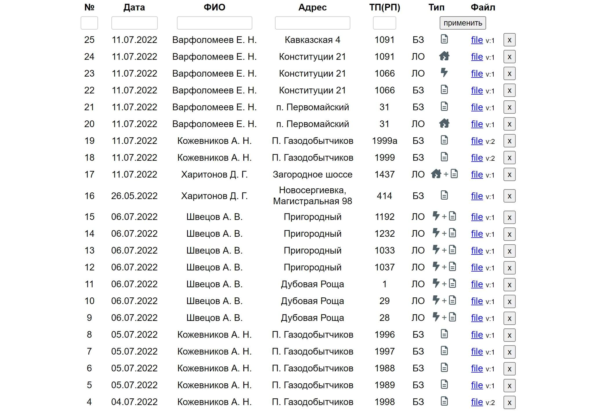
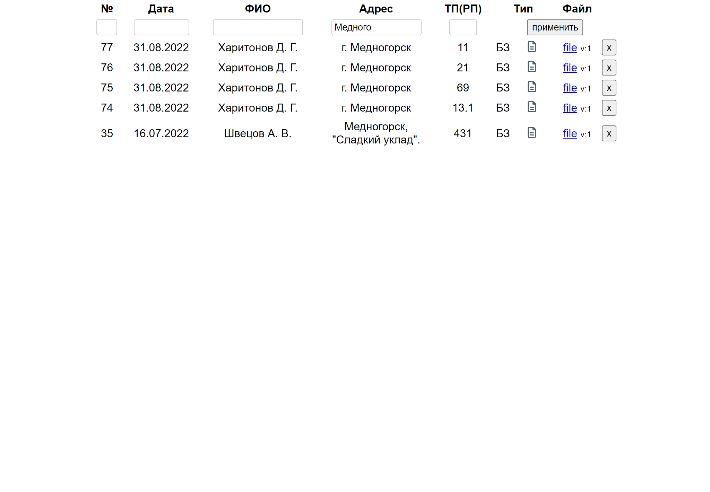
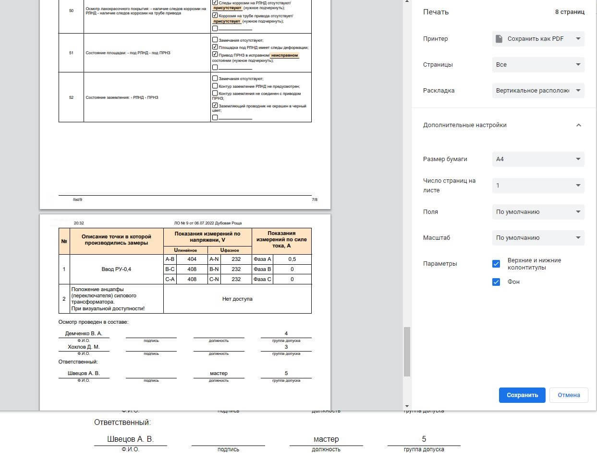

# terraServer
#### - это  серверная часть [мобильного приложения terra.apk](https://github.com/dsa25/terraApp), где хранится список осмотров и пользователи.
#### Ознакомиться можно тут: 
- [осмотры](https://terraserver.dsa25.ru/list)
- [пользователи](https://terraserver.dsa25.ru/users)
#### 
#### Stack:
- nodejs - веб-фреймворк [Fastify](https://fastify.io)
- база данных - sqlite
- sequelize - используется только для миграции моделей в таблицы БД
 

Страницы осмотров сделал одним файлом, чтобы при сохранении (ctrl+s в браузере) был только один файл example.html без дополнительных папок со скриптами и стилями.

Расположив скрипты и стили в тегах <script> и <style> соотверственно, в результате получил меньше удобств в разработке =) 

 

#### Screenshots:

<table>
  <tr>
    <td>Список осмотров</td>
    <td></td>
  </tr>
  <tr>
     <td>Фильтр поиска по осмотрам</td>
     <td></td>
  </tr>
  <tr>
    <td>Несколько стилей добавил для печати документа</td>
    <td></td>
   </tr>
</table>

